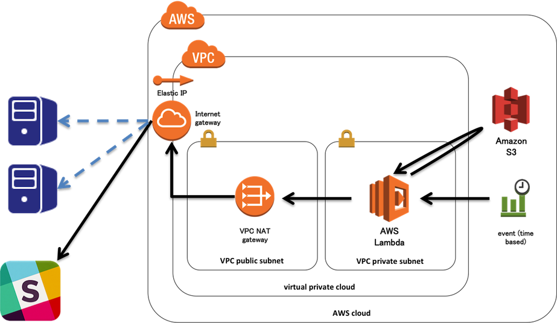

# lambda-python-server-checker
Check server status and send result to Slack

## 実現したこと

- 全体イメージ


---

- `S3`に監視先サーバーデータを配置する。
	- データの形式は以下の通り。

		```json:servers.json
		{
		    "servers": [
		        {"name": "Google", "url": "http://www.google.co.jp"},
		        {"name": "Yahoo", "url": "http://www.yahoo.co.jp"}
		    ]
		}
		```

- `AWS Lambda(Python)`から上記のデータを読み込み、各サーバーにHTTPアクセスを行う。

- 監視結果を`Slack`に通知する。
- 上記を、`CloudWatch Events - Schedule`で定期実行する。

## 設定詳細

### VPC設定

- 実現したかったことが、以下で完全に網羅されていたため、参照。
	- https://www.joyzo.co.jp/blog/2325

### IAM設定

- `Lambda`作成時に、roleのtemplateとして、`Simple Microservice permissions`を選択。
- `S3`にアクセスするため、`AmazonS3ReadOnlyAccess`のポリシーをアタッチ。
- `Lambda`を`VPC`上で実行するため、`AWSLambdaVPCAccessExecutionRole`のポリシーをアタッチ。

### CloudWatch Events - Schedule設定

- [Tutorial: Schedule Lambda Functions Using CloudWatch Events - Amazon CloudWatch Events](http://docs.aws.amazon.com/AmazonCloudWatch/latest/events/RunLambdaSchedule.html)

### Slack

- [Incoming Webhooks](https://api.slack.com/incoming-webhooks)を参照して、`Slack`への通知用URLを取得。

### AWS Lambda(Python)設定時の注意点

- ライブラリはソースコードと同じディレクトリに配置する。

```bash
pip install requests -t .
```

- ソースコードとライブラリをまとめて、zipにして配置する。

```bash
zip -r lambda_function.zip *
```

- [Programming Model for Authoring Lambda Functions in Python - AWS Lambda](http://docs.aws.amazon.com/lambda/latest/dg/python-programming-model.html)
